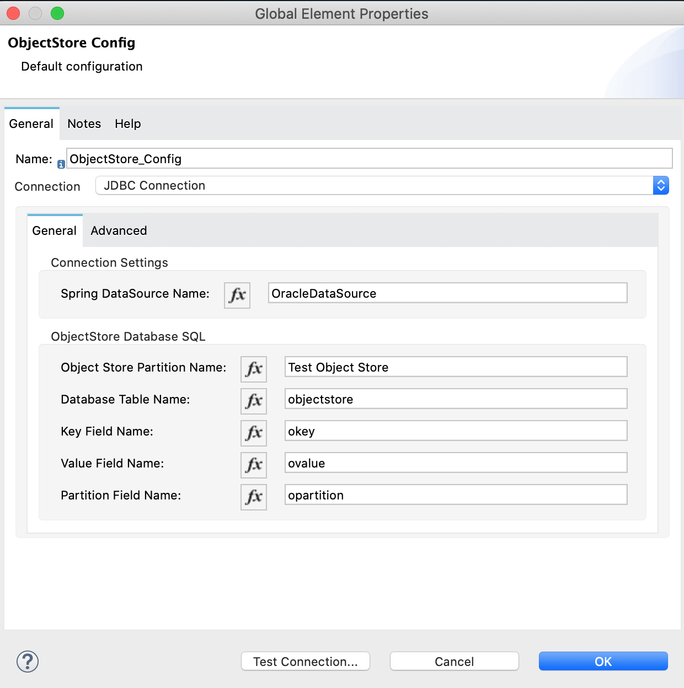

# JDBC Object Store Extension

When running Mule 4 naked Mules (on-prem installations), the out of the box Object Store store only supports persistence in-memory across the cluster via Hazelcast or by storing the objects on disk. 

In most cases this is fine, however, there are times where you may wish for the Object Store data to outlast the Mule Runtimes Lifecycle.  This shows up in containerized scenarios where the Mule Runtime(s) are created and destroyed often.

This JDBC Object Store Extension was created to allow storing and retrieving Object Store data from a JDBC Compliant Database.

## Pre-requisites

 1. A JDBC Compliant Database with an Object Store table.  Version 1.0.0 of this has been tested with 4 Databases:  Oracle (should work with 11 or higher), MySQL (should work with any version, tested with 8), Microsoft SQL Server (Should work with any version, tested with 14), and Apache Derby (should work with 10.13 or higher).  Sample table creation scripts have been provided in the project in the ddl directory.  A database other than the ones tested ***may*** work.  There is a method for storing the serialized object that is database independent.  However, every database handles BLOB data differently and therefore the generic method may not work.  Refer to the storeGeneric() method of the org.mulesoft.objectstore.custom.internal.os.JDBCObjectStore class.
 2. Your project must import the Spring Module.  This is because the JDBC Object Store Extensions needs a Spring Datasource in order to connect to the database properly.  Documentation on the Spring Module can be found here:  [Spring Module](https://docs.mulesoft.com/spring-module/1.3/).
 3. Your project needs a Spring Datasource.  Documentation on this can be found here: [Spring Based Datasources](https://help.mulesoft.com/s/article/Spring-based-datasources).

## How To

### Step 1:
Ensure the Pre-Reqs as defined above are fulfilled.

 - Sample pom.xml with the appropriate includes/dependencies can be found here: [pom.xml](docs/samples/pom.xml).
 - Sample Spring beans.xml with a sample Spring Datasource can be found here: [beans.xml](docs/samples/beans.xml).
 - Sample Mule Configuration file can be found here: [test-jdbc-object-store.xml](docs/samples/test-jdbc-object-store.xml).

### Step 2:

 - Add the Object Store Module to your project.
 - Ensure that you've added the JDBC Object Store Extension to your project either using a dependency in your pom file or by adding it from your Exchange.
 - Add an ObjectStore Config Global Element.
 - Configure the Connection drop-down of the ObjectStore Config and select JDBC Connection.  (If JDBC Connection option is not available, then you haven't properly imported the JDB Object Store Extension to your project.)
 - Configure the JDBC Connection options similar to the following: (ensure they match your Datasource configuration and your database object store table. Configuration reference for the JDBC Connection can be found below [here](#jdbc-connection-reference).)


**NOTE: The Test Connection button will not work.  This is a shortcoming of Anypoint Studio not this Extension.

### Step 3:
 - Add an Object store Global Element.  Ensure the Configuration Reference drop-down has selected your ObjectStore Config created in Step 2 above.

### Step 4:

 - Add Object Store Operations to your Mule Flow(s) and Enjoy!

**NOTE: Ensure the Object Store Operation(s) use the Object Store defined above in Step 3 by selecting the appropriate Object Store in the Object store drop-down of the Operation in question.

## Maven Configuration
Add this dependency to your mule application pom.xml. Full sample pom file can be found here: [pom.xml](docs/samples/pom.xml).

```
<groupId>org.mulesoft.objectstore.custom</groupId>
<artifactId>JDBCObjectStore</artifactId>
<version>1.0.0</version>
<classifier>mule-plugin</classifier>
```
## JDBC Connection Reference
### Parameters
|Name  |Type  |Description |Required? |
|--|--|--|--|
|Spring DataSource Name  |  String|The Name of the Spring DataSource to Obtain the Database Connection|X|
| Object Store Partition Name| String|The DB Table Hosting the Key/Value Pairs Needs the Abilty for Multiple Different Object Stores. This Partition Name is Part of the Primary Key to Separate |X|
|Database Table Name |String | Table Name in the Database used for Storing Key/Value Pairs|X|
| Key Field Name| String|The Name of the Table Field Holding the 'Keys' of the Key/Value Pairs |X |
|Value Field Name |String |The Name of the Table Field Holding the 'Values' of the Key/Value Pairs |X |
| Partition Field Name| String|The Name of the Table Field Holding the Partition Names of the Key/Value Pairs | X|
**IMPORTANT NOTES**:

 - The ObjectStore Config Reconnection configuration will not be honored.  All connection pool configuration is handled by the Spring Datasource.
 - The Object Store Configuration contains things like Entry ttl and Max entries.  These configurations are ignored due to the fact that this is a JDBC backed Object Store and persistence is clearly desired by virtue of using this extension. 