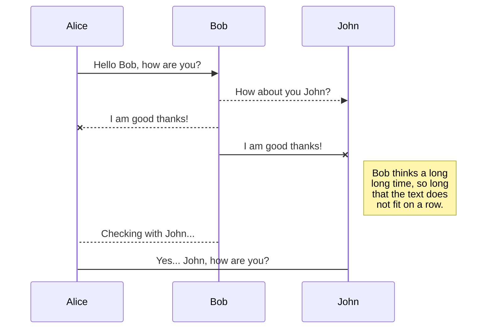
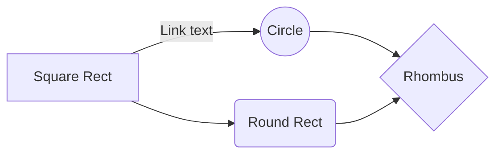

# JDBC Object Store Extension

For Naked Mules (on-prem installations), Mule 4's out of the box Object Store store only supports persistence in-memory across the cluster or on disk. 

In most cases this is fine, however, there are times where you may wish for the Object Store data to outlast the Mule Runtimes Lifecycle.  This shows up in containerized scenarios where the Mule Runtime(s) are created and destroyed often.

This JDBC Object Store Extension was created to allow storing and retrieving Object Store data from a JDBC Compliant Database.

## Pre-requisites

 1. A JDBC Compliant Database with an Object Store table.  Version 1.0.0 of this has been tested with 4 Databases:  Oracle (should work with 11 or higher), MySQL (should work with any version, tested with 8), Microsoft SQL Server (Should work with any version, tested with 14), and Apache Derby (should work with 10.13 or higher).  Sample table creation scripts have been provided in the project in the ddl directory.  A database other than the ones tested ***may*** work.  There is a method for storing the serialized object that is database independent.  However, every database handles BLOB data differently and therefore the generic method may not work.  Refer to the storeGeneric() method of the org.mulesoft.objectstore.custom.internal.os.JDBCObjectStore class.
 2. Your project must import the Spring Module.  This is because the JDBC Object Store Extensions needs a Spring Datasource in order to connect to the database properly.  Documentation on the Spring Module can be found here:  [Spring Module](https://docs.mulesoft.com/spring-module/1.3/).
 3. Your project needs a Spring Datasource.  Documentation on this can be found here: [Spring Based Datasources](https://help.mulesoft.com/s/article/Spring-based-datasources).

...


...


Add this dependency to your mule application pom.xml

```
<groupId>org.mulesoft.objectstore.custom</groupId>
<artifactId>JDBCObjectStore</artifactId>
<version>1.0.0</version>
<classifier>mule-plugin</classifier>
```

# Markdown extensions

StackEdit extends the standard Markdown syntax by adding extra **Markdown extensions**, providing you with some nice features.

> **ProTip:** You can disable any **Markdown extension** in the **File properties** dialog.


## SmartyPants

SmartyPants converts ASCII punctuation characters into "smart" typographic punctuation HTML entities. For example:

|                |ASCII                          |HTML                         |
|----------------|-------------------------------|-----------------------------|
|Single backticks|`'Isn't this fun?'`            |'Isn't this fun?'            |
|Quotes          |`"Isn't this fun?"`            |"Isn't this fun?"            |
|Dashes          |`-- is en-dash, --- is em-dash`|-- is en-dash, --- is em-dash|


## KaTeX

You can render LaTeX mathematical expressions using [KaTeX](https://khan.github.io/KaTeX/):

The *Gamma function* satisfying $\Gamma(n) = (n-1)!\quad\forall n\in\mathbb N$ is via the Euler integral

$$
\Gamma(z) = \int_0^\infty t^{z-1}e^{-t}dt\,.
$$

> You can find more information about **LaTeX** mathematical expressions [here](http://meta.math.stackexchange.com/questions/5020/mathjax-basic-tutorial-and-quick-reference).


## UML diagrams

You can render UML diagrams using [Mermaid](https://mermaidjs.github.io/). For example, this will produce a sequence diagram:



And this will produce a flow chart:

